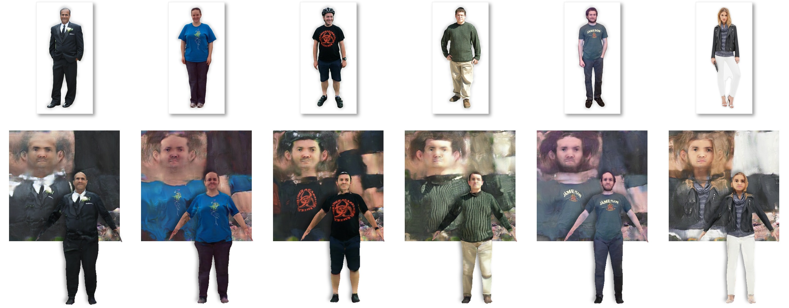
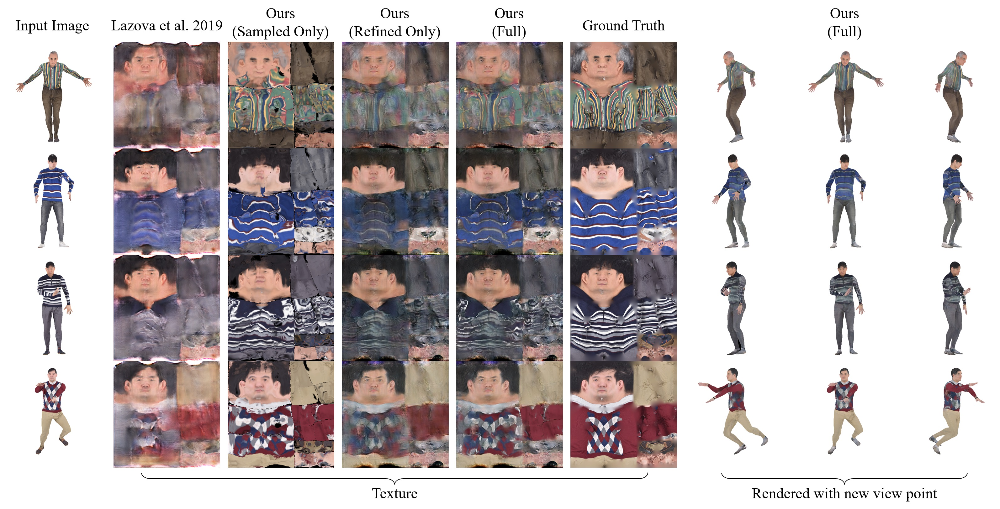

# Generating Texture for 3D Human Avatar from a Single Image using Sampling and Refinement Networks
<!--  -->

<!-- Official implementation code for **Sample&Refine: Generating 3D Human Texture from a Single Image using Sampling and Refinement Networks**. -->
Official implementation code for [**Generating Texture for 3D Human Avatar from a Single Image using Sampling and Refinement Networks**](https://diglib.eg.org/handle/10.1111/cgf14769) (EG 2023).

> Abstract: There has been significant progress in generating an animatable 3D human avatar from a single image. However, recovering texture for the 3D human avatar from a single image has been relatively less addressed. Because the generated 3D human avatar reveals the occluded texture of the given image as it moves, it is critical to synthesize the occluded texture pattern that is unseen from the source image. To generate a plausible texture map for 3D human avatars, the occluded texture pattern needs to be synthesized with respect to the visible texture from the given image. Moreover, the generated texture should align with the surface of the target 3D mesh. In this paper, we propose a texture synthesis method for a 3D human avatar that incorporates geometry information. The proposed method consists of two convolutional networks for the sampling and refining process. The sampler network fills in the occluded regions of the source image and aligns the texture with the surface of the target 3D mesh using the geometry information. The sampled texture is further refined and adjusted by the refiner network. To maintain the clear details in the given image, both sampled and refined texture is blended to produce the final texture map. To effectively guide the sampler network to achieve its goal, we designed a curriculum learning scheme that starts from a simple sampling task and gradually progresses to the task where the alignment needs to be considered. We conducted experiments to show that our method outperforms previous methods qualitatively and quantitatively.

<!--  -->


# Environments
We recommend to use Docker. Use **seokg1023/vml-pytorch:vessl** for the docker image. 

```bash
docker pull seokg1023/vml-pytorch:vessl
```

All dependencies for the environment are provided in requirements.txt.
```bash
pip install -r requirements.txt
```

### Todos
- [ ] data preparation (data structure, preprocessing, dataloader)
- [ ] network checkpoint
- [ ] evaluation code


# Setup

## Download checkpoints


## Data preparation (tdb)
The data needs to be pre-processed using [DensePose](https://github.com/facebookresearch/DensePose). \
The required pre-processing steps are needed:

1. Obtain indexed UV (IUV) using [DensePose](http://densepose.org/) from source image
2. Obtain partial texture maps from both source and mirrored view using UV lookup table
3. Produce a symmetric texture map by merging both partial texture maps.

you can also refer to [Pose-with-Style](https://github.com/BadourAlBahar/pose-with-style) for producing symmetric texture map. \

(Data preprocessing code will be added soon) \


## Start docker container
modify the code below or simply use **run_docker.sh** to start the docker container
```bash
docker run --gpus all \
    -it --rm --shm-size=8gb \
    seokg1023/vml-pytorch:vessl
```


## Training
use **train-SamplerNet.sh** to train the SamplerNet \
use **train-RefinerNet.sh** to train the RefinerNet 

```bash
bash train-SamplerNet.sh --gpu 0 # choose gpu device
bash train-RefinerNet.sh --gpu 0 # choose gpu device
```


## Evaluation
use **test-SamplerNet.sh** to train the SamplerNet \
use **test-RefinerNet.sh** to train the RefinerNet
```bash
bash test-SamplerNet.sh --gpu 0 # choose gpu device
bash test-RefinerNet.sh --gpu 0 # choose gpu device
```


# Citation
```
@inproceedings{cha2023generating,
  title={Generating Texture for 3D Human Avatar from a Single Image using Sampling and Refinement Networks},
  author={Cha, Sihun and Seo, Kwanggyoon and Ashtari, Amirsaman and Noh, Junyong},
  booktitle={Computer Graphics Forum},
  volume={42},
  number={2},
  pages={385--396},
  year={2023},
  organization={Wiley Online Library}
}
```
